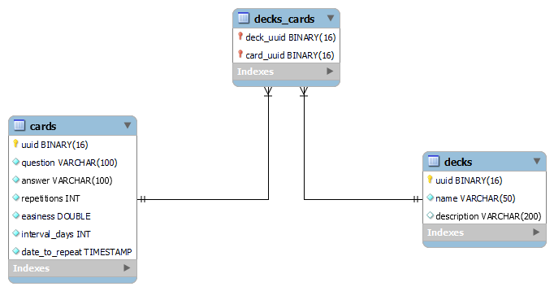

# Database design

## Enhanced Entity-Relationship

### Entities

#### Deck
Attributes:
- **uuid**: The deck UUID (_Universally Unique ID_). It has been designed as the `PRIMARY KEY` so cannot be `NULL`. The type is `BINARY(16)`. The constraint `UNIQUE` does not need to be specified as it is implicitly assumed in primary keys.
- **name**: The deck name. It has been designed as `VARCHAR(50)` to support up to 50 characters and cannot be `NULL`.
- **description**: The deck description. It has been designed as `VARCHAR(200)` to support up to 200 characters and can be `NULL`, as user might not want to enter a description for the deck.

#### Card
Attributes:
- **uuid**: The card UUID (_Universally Unique ID_). It has been designed as the `PRIMARY KEY` so cannot be `NULL`. The type is `BINARY(16)`. The constraint `UNIQUE` does not need to be specified as it is implicitly assumed in primary keys.
- **question**: The card question. It has been designed as `VARCHAR(100)` to support up to 100 characters and cannot be `NULL`.
- **answer**: The card answer. It has been designed as `VARCHAR(100)` to support up to 100 characters and cannot be `NULL`.
- **repetitions**: A value that is used by _SuperMemo2 Algorithm_ and represents the number of times since the origin of times that user has played this card. It has been designed as an `INTEGER` and `UNSIGNED` value which cannot be `NULL` with default value of zero.
- **easiness**: A value that is used by _SuperMemo2 Algorithm_ and is calculated based on how well the user remembered the card (i.e. _quality_ value). It has got a minimum value of 1.3. It has been designed as a `DOUBLE` value which cannot be `NULL` with default value of 2.5.
- **interval_days**: A value that is used by _SuperMemo2 Algorithm_ and represents the number of days until the day that user must review the card. It has been designed as an `INTEGER` and `UNSIGNED` value which cannot be `NULL` with default value of 0.
- **date_to_repeat**: The exact timestamp that the card must be reviewed. It has been designed as an `TIMESTAMP` which cannot be `NULL` with default value of `NOW()`.

### Relationships
#### Decks-Cards
This entity represents the relationship among Decks and Cards entities. Each row consists of the identifier of the deck and the identifier of the card that is contained inside that deck. The primary key is the pair `(deck_uuid, card_uuid)`.

Attributes:
- **deck_uuid**: The foreign key to deck UUID.
- **card_uuid**: The foreign key to card UUID.